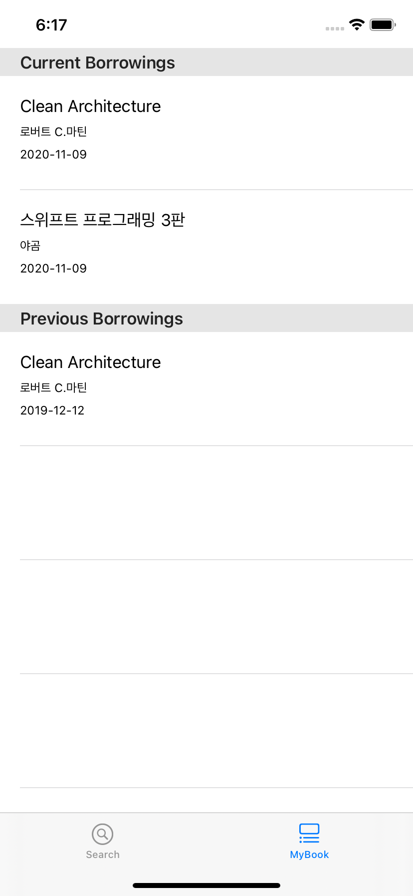

## OLIB - Over the LIBrary

An integrated library app.

  

## Features

- Authentication
- Searching books, retrieving my borrowings
- [Mock backend server](https://github.com/korJAEYOUNGYUN/olib_backend)

## Installation

```bash
git clone https://github.com/korJAEYOUNGYUN/olib.git
pod install
```
